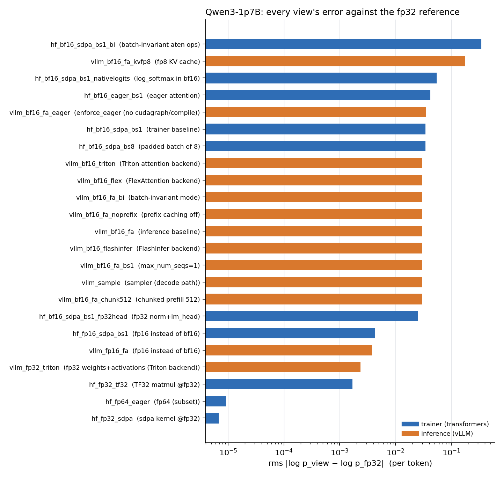
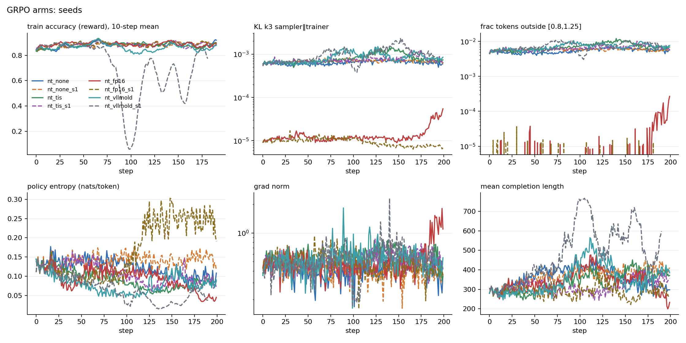

# Train/inference mismatch in LLM reinforcement learning

RL fine-tuning samples from one implementation of the policy (an inference
engine: vLLM, CUDA graphs, fused kernels, bf16) and takes gradients through
another (the trainer: transformers, SDPA, bf16 params with fp32 master
weights). Same weights, different function. This repo measures that gap
component by component, isolates where it comes from, and runs the proposed
fixes head to head inside a live GRPO loop.

Everything here was run on Qwen3-1.7B and Qwen3-8B with vLLM 0.12.0 and
transformers 4.57.6 on single H200s, 14 GPU-hours total.

## Headline results

<p align="center"></p>

1. **The gap is bf16 rounding on two independent paths, not kernels or
   scheduling.** Trainer error vs an fp32 reference is 0.035 nats/token rms,
   vLLM's is 0.030, and their mutual gap (0.045) is the quadrature sum
   (correlation of errors 0.03). Attention backend (FlashAttention, FlashInfer,
   Triton, Flex), scheduler batch width, chunked-prefill size and prefix caching
   all change the number by less than 3e-4. With both sides at fp32 the residual
   is 0.0024. The gap sits on tokens below 10% probability and is flat across
   positions.
2. **Fixes, ranked.** fp16 on both sides cuts the gap 8x at zero throughput
   cost. An fp32 LM head cuts the trainer's error 27 to 35% at a 29% throughput
   cost. An fp8 KV cache makes the sampler 4x worse. Computing log-softmax in
   bf16 adds a +0.005 systematic bias. vLLM's batch-invariant mode makes prefill
   and decode bit-identical but does not touch the trainer gap.
3. **A bug, isolated.** vLLM's batch-invariant `aten::bmm` override runs fp32
   inputs at roughly TF32 precision. transformers' Qwen3 rotary embedding
   computes its angles with an fp32 bmm whose values reach 7000 radians, so
   under the override 99.9% of positions get wrong cos/sin and the trainer's
   error jumps 10x. Bisected to the single override (`bench/probe_bi.py`),
   mechanism confirmed (`bench/probe_bmm.py`), fixed by computing the angles
   as an outer product (`mismatch/fp32head.py`).
4. **In GRPO (17 arms, 200 steps each).** Token-level corrections (TIS, MIS,
   IcePop) are indistinguishable from no correction. Sequence-level IS is the
   wrong tool at these lengths (effective sample size 5 to 15%). Feeding the
   sampler's logprobs into PPO's ratio, the realistic framework bug, collapsed
   on one of two seeds (accuracy 0.74 to 0.03 in ten steps) and dipped on the
   other; the mismatch monitor's KL and band-violation signals rose about 25
   steps before the reward fell. fp16 held the mismatch 40 to 100x lower in
   every regime.

<p align="center"></p>

Full write-up with every number: [`docs/RESULTS.md`](docs/RESULTS.md).
Generated tables: [`docs/RESULTS_MEASURE_Qwen3-1p7B.md`](docs/RESULTS_MEASURE_Qwen3-1p7B.md),
[`docs/RESULTS_MEASURE_Qwen3-8B.md`](docs/RESULTS_MEASURE_Qwen3-8B.md),
[`docs/RESULTS_RL.md`](docs/RESULTS_RL.md). Design and gates: [`docs/PLAN.md`](docs/PLAN.md).

## What is in the repo

```
config.py                 paths (from env), sampling settings, metric bands, numeric gates
mismatch/
  sample.py               stage 1: vLLM samples the corpus, records sampler logprobs
  score_vllm.py           stage 2: re-score the same tokens through vLLM prefill (every knob a flag)
  score_hf.py             stage 2: re-score through transformers (dtype, attn, batching, fp32 head, ...)
  views.py                the 24 configurations and the headline pairs
  run_views.py            one subprocess per view, resumable
  metrics.py              k3 KL, ratio bands, sequence IS ESS, bucketed gaps, error decomposition
  report.py               stage 3: gates M1-M3, attribution tables -> results/*.json, docs/*.md
  monitor.py              MismatchMonitor: drop-in per-step mismatch stats for any RL trainer
  fp32head.py             fp32 norm+head for HF and vLLM; RoPE-without-bmm fix
  store.py, common.py     .npz view format; prompts, gsm8k loading, answer checking
rl/
  grpo.py                 stage 4: single-GPU GRPO, in-process vLLM, weight sync every step
  engine.py               vLLM wrapper: generate, greedy eval, load_weights + prefix-cache reset
  policy.py               low-precision params + fp32 master/AdamW, loss scaling, checkpoints
  losses.py               none / tis / mis / icepop / seq_tis / vllm_old
  report.py               per-arm stability, mismatch drift, cost -> docs/RESULTS_RL.md
bench/
  plots.py                figures in docs/fig
  probe_bi.py             bisect vLLM's batch-invariant mode one component at a time
  probe_bmm.py            the RoPE bmm precision check
scripts/                  numbered stages, arm launcher, log watcher; slurm/submit.sh wraps them
tests/                    7 CPU test files (no GPU, no vLLM needed): make test
results/                  small JSON summaries, committed
```

## Running it

CPU only (about two minutes, needs torch and transformers, not vLLM):

```
cp env.sh.example env.sh      # set TIM_PY and TIM_DATA_ROOT
make test
```

GPU, one H200 (or any 80 GB+ card), with SLURM:

```
make measure MODEL=Qwen/Qwen3-1.7B          # stages 1-3: corpus, 24 views, report  (~45 min)
scripts/launch_arms.sh --list               # the GRPO arms
scripts/launch_arms.sh nt_none nt_tis nt_fp16 nt_vllmold   # one GPU each, ~40 min per arm
make report                                 # rebuild docs/RESULTS_RL.md from the step logs
python -m bench.plots
```

Without SLURM, call the stage scripts directly on a machine with a GPU:
`scripts/run_measure.sh Qwen/Qwen3-1.7B`, then `scripts/04_grpo.sh nt_none --mode none --no-thinking --max-tokens 768`.
Every stage is idempotent and resumable: views are skipped if their file
exists, GRPO resumes from its last checkpoint, and `slurm/submit.sh` refuses to
hold more than `TIM_MAX_GPUS` at once or to use a QOS above the configured one.

Models and datasets are loaded from the local HuggingFace cache
(`HF_HUB_OFFLINE=1` by default); you need `Qwen/Qwen3-1.7B` and `openai/gsm8k`
cached, and `Qwen/Qwen3-8B` for the size comparison.

## Using the monitor in your own trainer

```python
from mismatch.monitor import MismatchMonitor
mon = MismatchMonitor()                       # band [0.8, 1.25], clip 2.0 by default
stats = mon.update(logp_trainer, logp_sampler, completion_mask, step=step)
# stats["kl_k3"], stats["frac_outside_band"], stats["frac_tis_clipped"],
# stats["seq_is_ess_frac"], stats["by_train_prob"] ...
print(mon.diagnose(stats))
```

It costs a few elementwise ops on tensors you already have (0.13% of step time
here). In the collapsed run, `kl_k3` and `frac_outside_band` doubled 20 to 30
steps before the reward moved.

## Related work this builds on

- Yao et al., *Your efficient RL framework secretly brings you off-policy RL training* (TIS / MIS).
- MiniMax-M1 (fp32 LM head). - Qi et al., *Defeating the training-inference mismatch via FP16*.
- Ring-1T / IcePop (masking tokens outside a ratio band).
- Thinking Machines Lab, *Defeating nondeterminism in LLM inference*, and vLLM's `VLLM_BATCH_INVARIANT` mode.
- GSPO (sequence-level ratios) and R3 (routing replay) for the MoE case, which is not covered here.

## License

MIT. Status and next steps in [`STATUS.md`](STATUS.md).
